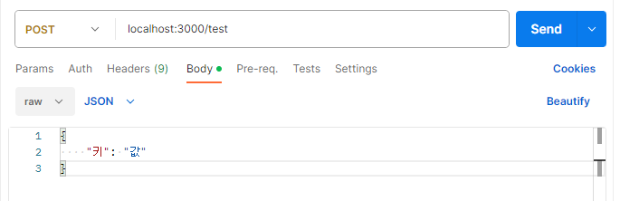

##### 23년 12월 11일 강의를 들은 내용과 추가로 더 학습한 내용을 기록한 글입니다.

### POST

생성(등록)해주는 HTTP METHOD
id, password, name, email, contact와 같은 개인정보는 숨겨서 보내는 것이 좋음

### 실습 - postman 사용해서 http method 사용해보기

#### GET

```js
const express = require("express");
const app = express();

app.listen(3000);

const db = new Map();

const youtuber1 = {
  channelTitle: "십오야",
  subscriber: 5930000,
  videoNum: 993
};
const youtuber2 = {
  channelTitle: "뜬뜬",
  subscriber: 1510000,
  videoNum: 168
};

db.set(1, youtuber1);
db.set(2, youtuber2);

app.get("/youtuber/:id", function (req, res) {
  const { id } = req.params;
  const youtuber = db.get(parseInt(id));
  console.log(id);
  if (!youtuber) {
    res.send("찾을 수 없는 유튜버입니다.");
  } else {
    res.send(youtuber);
  }
});
```

결과

#### POST

```js
app.use(express.json());

app.post("/test", (req, res) => {
  res.send(req.body);
});
```

결과

### 실습 2 - postman 사용해서 새로운 youtuber 생성하기

#### 기존 유튜버 데모

- 기존 유튜버 2명의 정보만 반환할 수 있었고, 새로운 유튜버를 등록할 수 없었음
- id가 1,2인 유튜버에 대한 api만 가지고 있음

```js
// express 모듈 셋팅
const express = require("express");
const app = express();

app.listen(3000);

//  데이터 세팅
const db = new Map();

const youtuber1 = {
  channelTitle: "십오야",
  subscriber: 5930000,
  videoNum: 993
};
const youtuber2 = {
  channelTitle: "뜬뜬",
  subscriber: 1510000,
  videoNum: 168
};

db.set(1, youtuber1);
db.set(2, youtuber2);

app.get("/youtuber/:id", function (req, res) {
  const { id } = req.params;
  const youtuber = db.get(parseInt(id));
  console.log(id);
  if (!youtuber) {
    res.send("찾을 수 없는 유튜버입니다.");
  } else {
    res.send(youtuber);
  }
});
```

결과


#### API 설계하고, 사용하기

#### API 설계

#### 1. 개별 조회 (GET)

- /youtubers/:id
  - id로 map에서 객체를 찾아서, 그 객체의 정보를 뿌려짐
  - req: url.params.id ← map에 저장된 key값을 전달
  - res: map에서 id로 객체를 조회해서 전달

#### 2. 등록 (POST)

- /youtubers
  - req: body ← `channelTitle, sub =0,vidioNum=0` 신규 유튜버 정보를 전달
  - res: 'channelTitle님, 유튜버가 되신걸 환영합니다!'

#### 3. 전체 조회 (GET)

- /youtubers
  - req: X
  - res: map을 전체 조회

#### 실습 2 - 등록하기

```js
// express 모듈 셋팅
const express = require("express");
const app = express();

app.listen(3000);

//  데이터 세팅
const db = new Map();

const youtuber1 = {
  channelTitle: "십오야",
  subscriber: 5930000,
  videoNum: 993
};
const youtuber2 = {
  channelTitle: "뜬뜬",
  subscriber: 1510000,
  videoNum: 168
};

db.set(1, youtuber1);
db.set(2, youtuber2);

app.use(express.json()); // http 외 모듈인 '미들웨어':json 설정

app.post("/youtubers", (req, res) => {
  const { channelTitle } = req.body;
  db.set(4, { channelTitle, sub: 0, videoNum: 0 });
  res.send({
    message: `${db.get(4).channelTitle}님, 유튜버가 되신걸 환영합니다!`
  });
});
```

결과


#### 코드 고도화하기

아이디 값을 변수로 설정해서, 자동으로 id 값이 플러스되도록 하기

```js
var id = 1;

const youtuber1 = {
  channelTitle: "십오야",
  subscriber: 5930000,
  videoNum: 993
};
const youtuber2 = {
  channelTitle: "뜬뜬",
  subscriber: 1510000,
  videoNum: 168
};

db.set(id++, youtuber1);
db.set(id++, youtuber2);
app.use(express.json()); // http 외 모듈인 '미들웨어':json 설정

app.post("/youtubers", (req, res) => {
  const { channelTitle } = req.body;
  db.set(id++, { channelTitle, sub: 0, videoNum: 0 });
  res.send({
    message: `${db.get(id - 1).channelTitle}님, 유튜버가 되신걸 환영합니다!`
  });
});
```

결과




### 실습 3 - 전체 조회

강의는 api를 설계하는 것에서 끝났는데,
나는 map Object를 Object로 변환하여 출력하면 될 것 같다고 생각하였고, `Object.fromEntries()`를 사용해서 map Object를 Object로 변환하여 resonse에 보내니, 잘 받아오는것을 확인할 수 있었다.

```js
app.get("/youtubers", (req, res) => {
  res.json(Object.fromEntries(db));
});
```

결과


전체 코드

```js
// express 모듈 셋팅
const express = require("express");
const app = express();

app.listen(3000);

//  데이터 세팅
const db = new Map();
var id = 1;

const youtuber1 = {
  channelTitle: "십오야",
  subscriber: 5930000,
  videoNum: 993
};
const youtuber2 = {
  channelTitle: "뜬뜬",
  subscriber: 1510000,
  videoNum: 168
};

db.set(id++, youtuber1);
db.set(id++, youtuber2);

app.use(express.json()); // http 외 모듈인 '미들웨어':json 설정

app.post("/youtubers", (req, res) => {
  const { channelTitle } = req.body;
  db.set(id++, { channelTitle, sub: 0, videoNum: 0 });
  res.send({
    message: `${db.get(id - 1).channelTitle}님, 유튜버가 되신걸 환영합니다!`
  });
});

app.get("/youtubers/:id", function (req, res) {
  const { id } = req.params;
  const youtuber = db.get(parseInt(id));
  if (!youtuber) {
    res.send("찾을 수 없는 유튜버입니다.");
  } else {
    res.send(youtuber);
  }
});

app.get("/youtubers", (req, res) => {
  res.json(Object.fromEntries(db));
});
```
