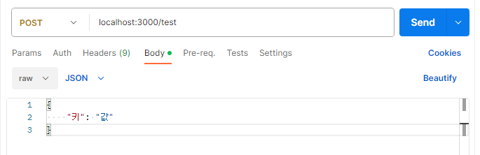
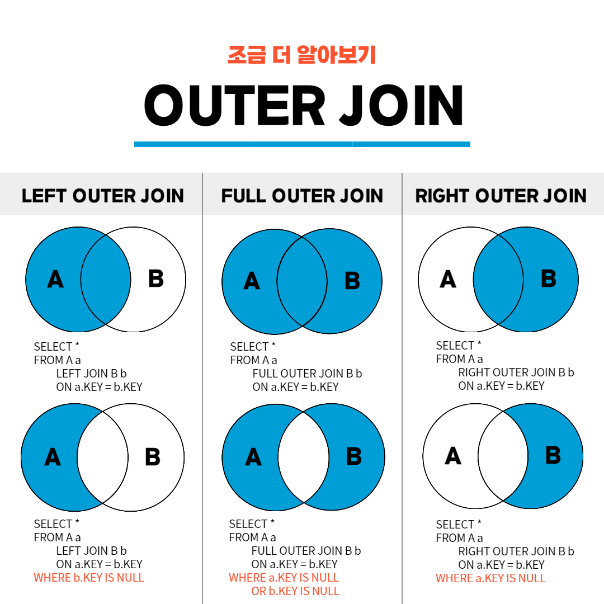

## 젠킨스 (Jenkins)

[https://www.jenkins.io/](https://www.jenkins.io/)

자바로 작성된 오픈 소스 자동화 서버이며, 지속적 인도 프로세스를 구축하는데 사용되고 있습니다. 장점으로는 유연성과 확장성이 있습니다.

### 📘젠킨스 특징

- 다양한 프로그래밍 언어 지원
- 플러그인을 통한 확장 (사용자가 직접 플러그인을 작성하여 젠킨스의 기능을 확장할 수도 있음)
- 이식성 (여러 종류의 컴퓨터에서뿐만 아니라 컨테이너 및 클러스터 환경에서도 부드럽게 적용)
- 대부분의 소스관리 시스템 지원
- 분산처리 지원 (마스터/슬레이브 구조를 사용하여 여러 노드에서 작업을 수행하도록 함)
- **코드로 파이프라인 구성** (프로세스 자동화에 적합하게 만들어줌)

### 📘젠킨스 아키텍처

#### 마스터 슬레이브 구조 (슬레이브는 에이전트라고 부르기도 함)

#### ■ 마스터

- 빌드 시작 트리거 포착 (코드 커밋)
- 알림 (빌드 실패를 사용자에게 전달)
- 클라이언트와 통신하며 HTTP 요청 처리
- 에이전트에서 실행 중인 작업의 우선순위를 조정하는 등 빌드 환경을 관리

#### ■ 에이전트

- 마스터에 의한 개시 후 모든 작업을 처리 (빌드 등)

### 📘수평적 확장

개발팀, 테스트팀, 데스옵스팀 등 조직이 늘어날 때 마다 마스터 인스턴스의 수를 늘려가는 방식

#### ■ 수직적 확장?

마스터에 대한 부하가 증가함에 따라 마스터 시스템에 자원을 추가하는 방식

#### ■ 수평적 확장의 장점

- 마스터 역할을 하는 컴퓨터의 하드웨어 사양에 대한 부담이 감소
- 팀마다 각기 다른 설정이 가능
- 팀 전용 마스터 인스턴스가 있으므로 팀워크와 업무 효율이 높아짐
- 마스터 인스턴스 하나에 문제가 생겨도 다른 팀에 끼치는 영향이 최소화됨

#### ■ 수평적 확장의 단점

- 통합 자동화가 복잡해짐

### 📘테스트 인스턴스와 프로덕션 인스턴스

젠킨스 인스턴스는 **항상 테스트용과 프로덕션용으로 분리 운용**해야함

#### ■ 프로덕션에 적용하기 이전에 철저한 검증을 걸쳐야 하는 시스템 설정

- 젠킨스 소프트웨어의 업데이트
- 신규 플러그인 적용
- CI/CD 파이프라인의 변경 및 유지보수

## CI/CD 시나리오

### 📘CI (Continuous Integration; 지속적 통합) 단계

- 일반적으로 개발자가 소스 코드를 커밋하고 푸시하면 시작됨
- 응용 소프트웨어를 자동으로 빌드하고, 통합시킴
- 테스트를 진행하고 배포할 수 있는 상태임을 확인해줌

### 📘CD (Continuous Delivery/Deployment; 지속적 인도) 단계

- CI 단계에서 소프트웨어가 배포가능한 상태일 때 시작됨
- 응용 소프트웨어를 컨테이너 이미지로 만듬
- 포드, 디플로이먼트, 서비스 등 다양한 오브젝트 조건에 맞추어 배포함 (미리 설정한 파일을 통해서)

### 📘지속적 통합 파이프라인 (CI Pipeline)

- 레포지토리에 코드 커밋이 발생할 때마다 빌드, 단위 테스트, 정적 분석을 함

## 젠킨스 사용을 위한 Helm 설치

### 📘Helm?

### 📘Ubuntu apt을 이용한 Helm 설치

#### 1. Helm을 받아오기 위한 apt repo 설정

```
$ echo "deb [arch=$(dpkg --print-architecture) \
signed-by=/usr/share/keyrings/helm.gpg] \
https://baltocdn.com/helm/stable/debian/ all main" | sudo tee /etc/apt/sources.list.d/helm-stable-debian.list
```

설정에 성공한다면 다음과 같은 메세지가 출력됨

```
deb [arch=amd64 signed-by=/usr/share/keyrings/helm.gpg] https://baltocdn.com/helm/stable/debian/ all main
```

#### 2. Helm 패키지 설치

```
$ sudo apt install -y helm
```

만약 설치에 실패할 경우 [공식문서](https://helm.sh/ko/docs/intro/install/)에서 알려주는 명령어를 사용해서 설치하는 것을 추천한다.

#### 3. helm 이용 가능 확인하기

```
$ which helm
```

- 메세지

```
/usr/sbin/helm
```

#### 4. helm을 이용하여 repo 설정하기

```
$helm repo add jenkinsci https://charts.jenkins.io
```

- 메세지

```
"jenkinsci" has been added to your repositories
```

#### 5. helm repo 업데이트하기

```
helm repo update
```

- 메세지

```
Hang tight while we grab the latest from your chart repositories...
...Successfully got an update from the "jekinsci" chart repository
Update Complete. ⎈Happy Helming!⎈
```

#### 6. 젠킨슨 설치하기

```
helm install jenkins jenkinsci/jenkins
```

- Error! 만약 쿠버네티스가 설치되어있지 않다면 명령어는 실행되지 않음!

```
Error: INSTALLATION FAILED: Kubernetes cluster unreachable: Get "http://localhost:8080/version": dial tcp 127.0.0.1:8080: connect: connection refused
```

## 젠킨슨 기본 사용법

### 📘젠킨스 접속

```
kubectl port-forward svc/jenkins 8080:8080

Forwarding from 127.0.0.1:8080 -> 8080
Forwarding from [::1]:8080 -> 8080
```

브라우저에서 localhost:8080으로 접속하여 초기화면이 나오는 것을 확인



### 📘젠킨스 로그인

- 계정 `admin`으로 로그인

#### ■ 비밀번호 알아내기

```kubectl get secret jenkins -o jsonpath="{.data.jenkins-admin-password}" | base64 --decode &&
 echo
```

- `kubectl get secret jenkins` - base64 인코드되어 적혀있음



### 📘젠킨스 비밀번호 변경하기

Users - Jenkins Admin - Configure에서 변경한 사항은 포드가 새로 실행될 때 적용되지 않아 원래 비밀번호로 되돌려짐

```
kubectl get secrets jenkins

NAME      TYPE     DATA   AGE
jenkins   Opaque   2      7h18m
```

```
kubectl edit secrets jenkins

data:
  jenkins-admin-password: a2ZFdnJzcHdDNVAxMzBQRXpBZ3Z2RA==
  jenkins-admin-user: YWRtaW4=
```

원하는 문자열을 base64로 인코딩해서 쿠버네티스 설정 파일에 적용

```
echo "vmfhrmfoajtm" | base64

dm1maHJtZm9hanRtCg==
```

```
kubectl edit secrets jenkins

data:
  jenkins-admin-password: dm1maHJtZm9hanRtCg==
  jenkins-admin-user: YWRtaW4=

secret/jenkins edited
```

Vim 편집기를 사용하고 있다면 `:wq`를 입력하고 빠져나오면 됨

### 📘언어 설정하기

- 플러그인 `Locale` 설치
- Manage Jenkins - System - Locale

### 📘시간대 변경하기

- People - [계정 선택] - Configure - User Defined Time Zone
