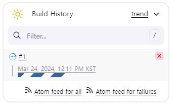

## 젠킨슨으로 helloworld 찍어보기

### 1. 젠킨슨 실행

```
kubectl port-forward svc/jenkins 8080:8080

Forwarding from 127.0.0.1:8080 -> 8080
Forwarding from [::1]:8080 -> 8080
```

### 2. 로그인해서 젠킨스에 접속하기

비밀번호를 모른다면

```
kubectl get secret
kubectl edit secret
```

을 사용하여 확인하고 변경할 수 있음

### 3. `new item`을 클릭해서 새로운 아이템 만들기

아이템 이름을 입력하고, pipeline을 선택한 후 ok 버튼 누르기

### 4. `Pipeline` 섹션에 해당 코드 입력하기

```
pipeline {
    agent any
    stages {
        stage("Hello"){
            steps {
                echo 'hello, world'
            }
        }
    }
}
```

`save 버튼` 눌러서 저장하기

### 5. 왼쪽 사이드바에서 build now를 클릭



빌드가 완료되면 로딩바가 멈춤  
#1 옆에 있는 드롭다운 버튼을 클릭하고, `console output`을 클릭

<details>

<summary>
콘솔 아웃풋
</summary>

```
Started by user Jenkins Admin
[Pipeline] Start of Pipeline
[Pipeline] node
Still waiting to schedule task
‘default-l37t3’ is offline
Agent default-qrtwq is provisioned from template default
---
apiVersion: "v1"
kind: "Pod"
metadata:
  labels:
    jenkins/jenkins-jenkins-agent: "true"
    jenkins/label-digest: "500b4f18aee87616849e4f4c2435020898e34aa0"
    jenkins/label: "jenkins-jenkins-agent"
  name: "default-qrtwq"
  namespace: "default"
spec:
  containers:
  - args:
    - "********"
    - "default-qrtwq"
    env:
    - name: "JENKINS_SECRET"
      value: "********"
    - name: "JENKINS_TUNNEL"
      value: "jenkins-agent.default.svc.cluster.local:50000"
    - name: "JENKINS_AGENT_NAME"
      value: "default-qrtwq"
    - name: "JENKINS_NAME"
      value: "default-qrtwq"
    - name: "JENKINS_AGENT_WORKDIR"
      value: "/home/jenkins/agent"
    - name: "JENKINS_URL"
      value: "http://jenkins.default.svc.cluster.local:8080/"
    image: "jenkins/inbound-agent:3206.vb_15dcf73f6a_9-3"
    imagePullPolicy: "IfNotPresent"
    name: "jnlp"
    resources:
      limits:
        memory: "512Mi"
        cpu: "512m"
      requests:
        memory: "512Mi"
        cpu: "512m"
    tty: false
    volumeMounts:
    - mountPath: "/home/jenkins/agent"
      name: "workspace-volume"
      readOnly: false
    workingDir: "/home/jenkins/agent"
  nodeSelector:
    kubernetes.io/os: "linux"
  restartPolicy: "Never"
  serviceAccountName: "default"
  volumes:
  - emptyDir:
      medium: ""
    name: "workspace-volume"

Running on default-qrtwq in /home/jenkins/agent/workspace/hello_world
[Pipeline] {
[Pipeline] stage
[Pipeline] { (Hello)
[Pipeline] echo
hello, world
[Pipeline] }
[Pipeline] // stage
[Pipeline] }
[Pipeline] // node
[Pipeline] End of Pipeline
Finished: SUCCESS

```

</details>

---

#### System 내용

- `# of executors`: executors를 몇개까지 설정할 것인가

- `Quiet period`: 빌드하기 전에 잠깐 기다리는 시간

## 정리

젠킨스는 아이템 단위로 프로젝트를 관리함
