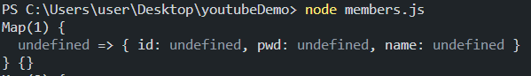
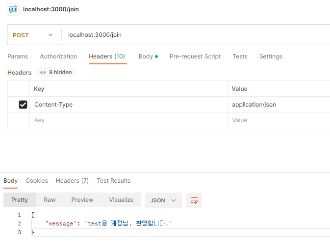

### json parse를 위해 `app.use(express.json())`을 입력했는데도, body 값을 받아오지 못하는 오류



```js
const express = require("express");
const app = express();

const db = new Map();

app.use(express.json());

// 회원가입
app.post("/join", (req, res) => {
  const { id, pwd, name } = req.body;
  if (id && pwd && name) {
    db.set(id, { id, pwd, name });
    const member = db.get(id);
    res.status(201).send({ message: `${member.name}님, 환영합니다.` });
  } else {
    res.status(400).send({ message: "잘못된 요청입니다." });
  }
});
```

postman에서 req.body 값을 전달 날렸지만, 서버에서는 해당 값을 받아오지 못하고 있었다.
JSON 요청을 parse할 수 있도록 도와주는 middleware 코드도 작성했지만 제대로 받아오지 못하고 있었다.

request header에 `{Content-Type : application/json}` 이라는 코드를 작성해 같이 요청을 보내니, 제대로 받아온다.


