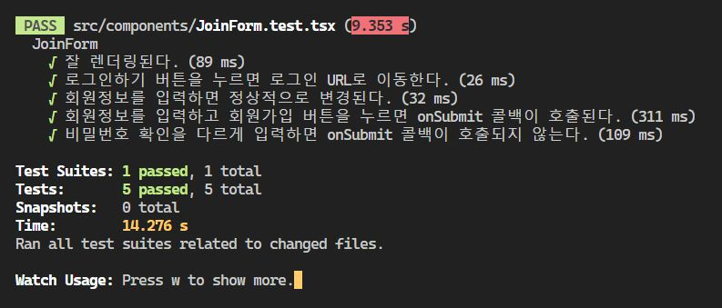

부트캠프 스프린트 4 프로젝트에서 회원가입페이지를 생성하고, 회원가입 폼이 제대로 작동하는지 단위테스트를 실행하는 실습을 하였다.

프론트엔드 코드는 각자 설계서에 맞춰서 자유롭게 작성하면 되었기 때문에 나는 `react-hook-form`을 사용하여 회원가입, 로그인 폼을 작성하였다.

개발서버에서 실제로 잘 작동하는 것을 확인하였고, 테스트 코드를 작성하였다. 강의 내용을 참고하여 테스트 코드를 작성하였으나, 계속 실패하였다.


강사님과는 다르게 `react-hook-form`을 사용해서 발생하는 문제라는 생각이 들었고, [react-hook-form 공식문서](https://react-hook-form.com/advanced-usage#TestingForm)에 들어가보니,

```
Test submission failure.

We are using waitFor util and find* queries to detect submission feedback, because the handleSubmit method is executed asynchronously.
```

`handleSumit` 메소드는 비동기적으로 실행되기 때문에 제출 결과를 감지하려면 `waitFor`를 활용해야 한다고 적혀있었다.

테스트 4번 "회원정보를 입력하고 회원가입 버튼을 누르면 onSubmit 콜백이 호출된다." 에서 기대 결과를 `waitFor`로 매핑했더니, 테스트가 성공적으로 수행되었다.

```js
test("회원정보를 입력하고 회원가입 버튼을 누르면 onSubmit 콜백이 호출된다.", async () => {
  // ... 이전 코드들
  await waitFor(() => {
    expect(mockLogin).toBeCalledWith({
      email: "foo@example.com",
      password: "1234",
      checkedPassword: "1234"
    });
  });
});
```



- JoinForm 코드

```tsx
import { Link } from "react-router-dom";
import { useForm } from "react-hook-form";
import Fieldset from "./common/Fieldset";
import { LinkJoin } from "./LoginForm";
import Form from "./common/Form";
import FormErrorMsg from "./common/FormErrorMsg";
import { IAuthState } from "@/types/user";

interface JoinFormProps {
  onSubmit: (data: IAuthState) => void;
}
const JoinForm = ({ onSubmit }: JoinFormProps) => {
  const {
    register,
    handleSubmit,
    watch,
    formState: { errors }
  } = useForm<IAuthState>();

  // 비밀번호를 실시간으로 관찰 (비밀번호 확인과 일치여부 확인용)
  const password = watch("password");

  const onSubmitHandler = (data: IAuthState) => {
    const { password, checkedPassword } = data;
    if (password !== checkedPassword) {
      return window.alert("비밀번호가 일치하지 않습니다.");
    }
    onSubmit(data);
  };

  return (
    <Form
      onSubmit={handleSubmit(onSubmitHandler)}
      title="회원가입"
      additional={
        <LinkJoin>
          <p>이미 계정을 가지고 계신가요?</p> <Link to="/login">로그인</Link>
        </LinkJoin>
      }
    >
      <Fieldset label="이메일" fieldsetId="emailInput">
        <input
          type="email"
          {...register("email", { required: true })}
          id="emailInput"
        />
        {errors.email && (
          <FormErrorMsg message="이메일은 필수로 입력해야합니다." />
        )}
      </Fieldset>

      <Fieldset label="비밀번호" fieldsetId="passwordInput">
        <input
          type="password"
          {...register("password", { required: true })}
          id="passwordInput"
        />
        {errors.password && (
          <FormErrorMsg message="비밀번호는 필수로 입력해야합니다." />
        )}
      </Fieldset>

      <Fieldset label="비밀번호 확인" fieldsetId="checkPasswordInput">
        <input
          type="password"
          {...register("checkedPassword", {
            required: true,
            validate: (value) =>
              value === password || "비밀번호가 일치하지 않습니다."
          })}
          id="checkPasswordInput"
        />
        {errors.checkedPassword && (
          <FormErrorMsg message="비밀번호를 한번 더 입력해주세요." />
        )}
      </Fieldset>
    </Form>
  );
};

export default JoinForm;
```

- JoinForm.test 코드

```tsx
import { act, fireEvent, screen, waitFor } from "@testing-library/react";
import { renderWithRouter } from "@/utils/test/renderWithRouter";
import JoinForm from "./JoinForm";
import { ThemeProvider } from "styled-components";
import { theme } from "@/styles/theme";
import { IAuthState } from "@/types/user";

const mockLogin = jest.fn((data: IAuthState) => {
  return Promise.resolve(data);
});

describe("JoinForm", () => {
  test("잘 렌더링된다.", () => {
    const onSubmit = jest.fn();
    renderWithRouter(
      <ThemeProvider theme={theme}>
        <JoinForm onSubmit={onSubmit} />
      </ThemeProvider>
    );

    expect(
      screen.getByLabelText("이메일", { selector: "input" })
    ).toBeInTheDocument();
    expect(
      screen.getByLabelText("비밀번호", { selector: "input" })
    ).toBeInTheDocument();
    expect(
      screen.getByLabelText("비밀번호 확인", { selector: "input" })
    ).toBeInTheDocument();
    expect(
      screen.getByText("회원가입", { selector: "button" })
    ).toBeInTheDocument();
    expect(screen.getByText("로그인", { selector: "a" })).toBeInTheDocument();
  });

  test("로그인하기 버튼을 누르면 로그인 URL로 이동한다.", () => {
    const onSubmit = jest.fn();
    renderWithRouter(
      <ThemeProvider theme={theme}>
        <JoinForm onSubmit={onSubmit} />
      </ThemeProvider>
    );

    fireEvent.click(screen.getByText("로그인"));
    expect(window.location.pathname).toBe("/login");
  });

  test("회원정보를 입력하면 정상적으로 변경된다.", () => {
    renderWithRouter(
      <ThemeProvider theme={theme}>
        <JoinForm onSubmit={mockLogin} />
      </ThemeProvider>
    );

    // 이메일, 비밀번호, 비밀번호 확인 input 요소를 선택
    const emailInput = screen.getByLabelText("이메일") as HTMLInputElement;
    const passwordInput = screen.getByLabelText("비밀번호") as HTMLInputElement;
    const passwordConfirmInput = screen.getByLabelText(
      "비밀번호 확인"
    ) as HTMLInputElement;

    // 값 변경
    fireEvent.change(emailInput, { target: { value: "foo@example.com" } });
    fireEvent.change(passwordInput, { target: { value: "1234" } });
    fireEvent.change(passwordConfirmInput, { target: { value: "123456" } });

    // 값이 정상적으로 변경되었는지 확인
    expect(emailInput.value).toBe("foo@example.com");
    expect(passwordInput.value).toBe("1234");
    expect(passwordConfirmInput.value).toBe("123456");
  });

  test("회원정보를 입력하고 회원가입 버튼을 누르면 onSubmit 콜백이 호출된다.", async () => {
    renderWithRouter(
      <ThemeProvider theme={theme}>
        <JoinForm onSubmit={mockLogin} />
      </ThemeProvider>
    );

    // 이메일, 비밀번호, 비밀번호 확인 input 요소를 선택
    const emailInput = screen.getByLabelText("이메일") as HTMLInputElement;
    const passwordInput = screen.getByLabelText("비밀번호") as HTMLInputElement;
    const passwordConfirmInput = screen.getByLabelText(
      "비밀번호 확인"
    ) as HTMLInputElement;

    // 값 변경
    fireEvent.change(emailInput, { target: { value: "foo@example.com" } });
    fireEvent.change(passwordInput, { target: { value: "1234" } });
    fireEvent.change(passwordConfirmInput, { target: { value: "1234" } });

    // 회원가입 폼 제출
    fireEvent.submit(screen.getByRole("button"));

    await waitFor(() => {
      expect(mockLogin).toBeCalledWith({
        email: "foo@example.com",
        password: "1234",
        checkedPassword: "1234"
      });
    });
  });

  test("비밀번호 확인을 다르게 입력하면 onSubmit 콜백이 호출되지 않는다.", async () => {
    renderWithRouter(
      <ThemeProvider theme={theme}>
        <JoinForm onSubmit={mockLogin} />
      </ThemeProvider>
    );

    // 이메일, 비밀번호, 비밀번호 확인 input 요소를 선택
    const emailInput = screen.getByLabelText("이메일") as HTMLInputElement;
    const passwordInput = screen.getByLabelText("비밀번호") as HTMLInputElement;
    const passwordConfirmInput = screen.getByLabelText(
      "비밀번호 확인"
    ) as HTMLInputElement;

    // 값 변경
    fireEvent.input(emailInput, { target: { value: "foo@example.com" } });
    fireEvent.input(passwordInput, { target: { value: "1234" } });
    fireEvent.input(passwordConfirmInput, { target: { value: "1234567" } });

    // 회원가입 폼 제출
    fireEvent.submit(screen.getByRole("button"));
    expect(await screen.findAllByRole("alert")).toHaveLength(1);
    expect(await mockLogin).not.toBeCalled();
  });
});
```
