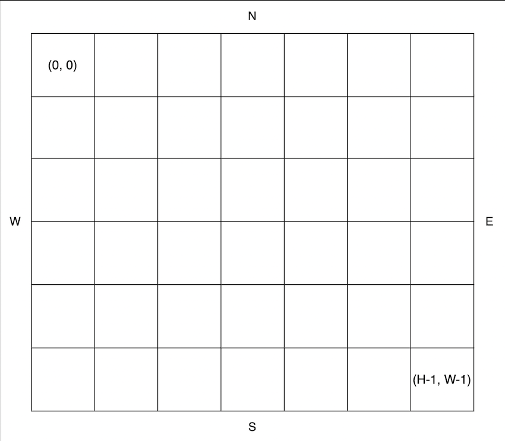

[https://school.programmers.co.kr/learn/courses/30/lessons/172928](https://school.programmers.co.kr/learn/courses/30/lessons/172928)

## 📔 문제 설명

지나다니는 길을 'O', 장애물을 'X'로 나타낸 직사각형 격자 모양의 공원에서 로봇 강아지가 산책을 하려합니다. 산책은 로봇 강아지에 미리 입력된 명령에 따라 진행하며, 명령은 다음과 같은 형식으로 주어집니다.

["방향 거리", "방향 거리" … ]
예를 들어 "E 5"는 로봇 강아지가 현재 위치에서 동쪽으로 5칸 이동했다는 의미입니다. 로봇 강아지는 명령을 수행하기 전에 다음 두 가지를 먼저 확인합니다.

주어진 방향으로 이동할 때 공원을 벗어나는지 확인합니다.
주어진 방향으로 이동 중 장애물을 만나는지 확인합니다.
위 두 가지중 어느 하나라도 해당된다면, 로봇 강아지는 해당 명령을 무시하고 다음 명령을 수행합니다.
공원의 가로 길이가 W, 세로 길이가 H라고 할 때, 공원의 좌측 상단의 좌표는 (0, 0), 우측 하단의 좌표는 (H - 1, W - 1) 입니다.


공원을 나타내는 문자열 배열 park, 로봇 강아지가 수행할 명령이 담긴 문자열 배열 routes가 매개변수로 주어질 때, 로봇 강아지가 모든 명령을 수행 후 놓인 위치를 [세로 방향 좌표, 가로 방향 좌표] 순으로 배열에 담아 return 하도록 solution 함수를 완성해주세요.

💡 입출력 예

| park                      | routes              | result |
| ------------------------- | ------------------- | ------ |
| ["SOO","OOO","OOO"]       | ["E 2","S 2","W 1"] | [2,1]  |
| ["SOO","OXX","OOO"]       | ["E 2","S 2","W 1"] | [0,1]  |
| ["OSO","OOO","OXO","OOO"] | ["E 2","S 3","W 1"] | [0,0]  |

## 💻내가 작성한 코드

내가 작성한 코드는 많은 문제들이 런타임 오류가 떠서 다른 사람의 풀이를 참고하였다....

## 💻다른 사람 코드

```js
function solution(park, routes) {
  const 방향배열 = { E: [0, 1], W: [0, -1], S: [1, 0], N: [-1, 0] };
  let 시작 = [0, 0];

  for (let i = 0; i < park.length; i++) {
    if (park[i].includes("S")) {
      시작 = [i, park[i].indexOf("S")];
      break;
    }
  }

  routes.forEach((route) => {
    const [방향, 거리] = route.split(" ");
    let [y이동, x이동] = 시작;
    let 걸음수 = 0;
    while (걸음수 < 거리) {
      [y이동, x이동] = [y이동 + 방향배열[방향][0], x이동 + 방향배열[방향][1]];
      if (!park[x이동] || !park[x이동][y이동] || park[y이동][x이동] === "X")
        break;
      걸음수++;
    }
    if (걸음수 == 거리) 시작 = [y이동, x이동];
  });
  return 시작;
}
```
